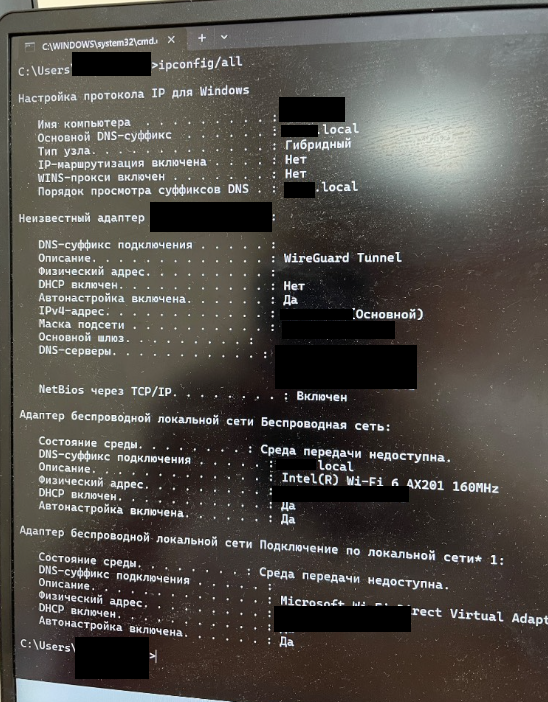
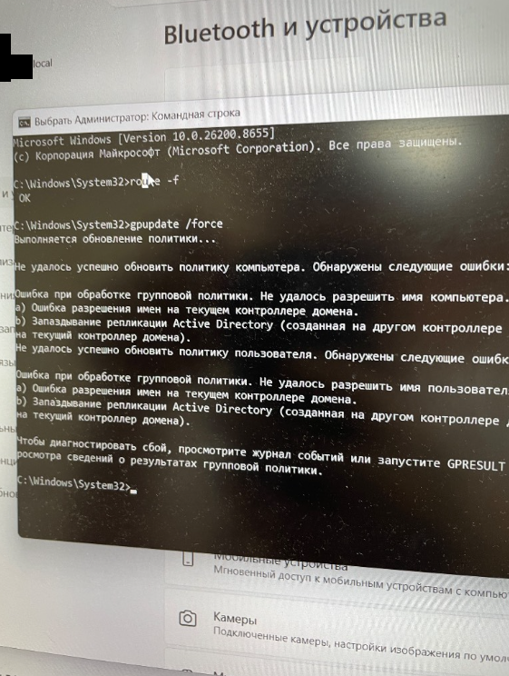
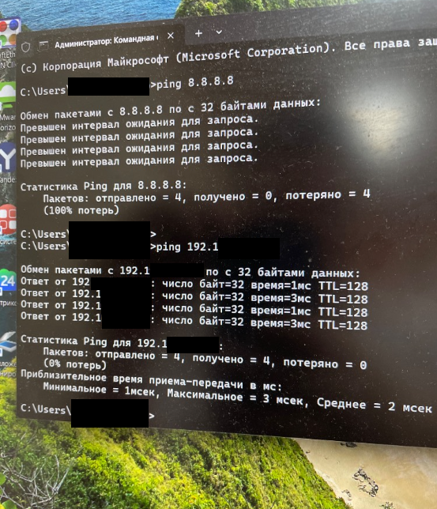

# DHCP vs L2/L3 Static ARP Desynchronization Mitigation


## Problem Overview & Root Cause Analysis

### Incident Summary
Remote workstations authenticating to a corporate domain (`corp.internal`) reported total outbound Internet connectivity loss upon connecting via Wireless interfaces (Intel Wi-Fi 6 AX201). Internal domain resources and the local default gateway (`192.168.10.100`) were reachable over ICMP (`<3ms`), while outbound traffic to external endpoints (`8.8.8.8`) timed out with 100% packet loss.

### Root Cause
1. **L2/L3 State Discrepancy:** The core gateway router maintained legacy static ARP bindings for specific IP addresses (`192.168.10.24`, `192.168.10.116`) bound to decommissioned physical MAC addresses.
2. **IPAM Misalignment:** The enterprise DHCP server assigned these addresses dynamically to new wireless clients without matching exclusion ranges in the DHCP scope.
3. **Asymmetric Blackholing:** 
   - Outbound traffic: Workstation routed frames to Gateway MAC (passed).
   - Inbound reply: Gateway consulted its hardcoded static ARP cache instead of broadcasting an ARP request, routing replies to non-existent hardware.

## Architecture & Topology

```text
+----------------------------------------------------------------+

|                        Active Directory                        |
|                    Windows Server DHCP Scope                   |
|                        (192.168.10.0/24)                       |
+-------------------------------+--------------------------------+
                                | Dynamic Allocation
                                v
+------------------+     +-------------------+     +-------------+

| Wireless Client  | --> |  Default Gateway  | --> |  Internet   |
| (Dynamic IP: .24)|     | (Static ARP: .24) |     |  (8.8.8.8)  |
+------------------+     +---------+---------+     +-------------+
        ^                          |
        | [X] Dropped Frames       v [Target: Stale MAC]
        +------------------ (Black Hole)
```
## Investigation & Evidence

### 1. Initial State & Tunnel Inspection
Analysis of network interfaces revealed an unassociated wireless adapter state alongside an active WireGuard tunnel adapter:



### 2. Domain Trust & Group Policy Verification
Execution of `gpupdate /force` validated that the machine temporarily failed domain controller name resolution due to route/interface isolation:



### 3. Asymmetric Traffic Blackholing Verification
Local gateway/domain controller responded with minimal latency (`<3ms`), confirming functional physical L2 link, while outbound egress traffic was dropped entirely (100% loss):



## Solution Components

- **Reconciliation Engine (`scripts/audit_dhcp_arp_conflict.ps1`):** Cross-references active dynamic leases from Windows DHCP with neighbor table cache to detect MAC collisions.
- **Dynamic Scope Sanitizer (`scripts/fix_dhcp_exclusions.ps1`):** Injects single-host exclusion ranges into the DHCP scope to immediately remove unmanaged static IPs from the allocation pool.

## Deployment & Execution

### Prerequisites
- Windows PowerShell 5.1 or PowerShell 7+ running with administrative privileges.
- RSAT Active Directory & DHCP Administration tools installed.

```powershell
# Verify RSAT DHCP module installation
Get-WindowsFeature -Name RSAT-DHCP
```

### 1. Run the Reconciliation Audit
```powershell
pwsh ./scripts/audit_dhcp_arp_conflict.ps1 `
  -ScopeId "192.168.10.0" `
  -GatewayIp "192.168.10.1" `
  -LogPath "./dhcp_arp_audit.log"
```

### 2. Enforce Scope Exclusions
To eliminate collisions without dropping legacy hardware reservations:
```powershell
pwsh ./scripts/fix_dhcp_exclusions.ps1 `
  -ScopeId "192.168.10.0" `
  -ConflictingIPs @("192.168.10.24", "192.168.10.116")
```

## Verification & Healthcheck

Validate that routing and resolution are restored:

```powershell
# 1. Flush local client resolver cache and renew lease
ipconfig /release
ipconfig /renew
ipconfig /flushdns

# 2. Check ARP resolution integrity
arp -a | findstr "192.168.10."

# 3. Verify outbound Layer 3 pathing
Test-NetConnection -ComputerName 8.8.8.8 -Port 53
Test-NetConnection -ComputerName "gateway.corp.internal" -Port 445
```

## Key Takeaways
- Static ARP entries must never overlap with dynamic DHCP allocation ranges.
- Dual-homed endpoints (Domain + WireGuard/VPN) amplify blackholing effects when split-tunnel routing relies on default route overrides.

## Copyright and License

Copyright (c) 2026 zazauzr. All rights reserved.

This repository and all its contents (including documentation, scripts, and configuration files) are proprietary. Unauthorized copying, modification, distribution, or commercial use of any materials from this repository, via any medium, is strictly prohibited without the express prior written permission of the copyright holder.

This repository and its associated automation assets are proprietary intellectual property. Unauthorized copying, distribution, modification, or commercial exploitation of this material via any medium is strictly prohibited.
